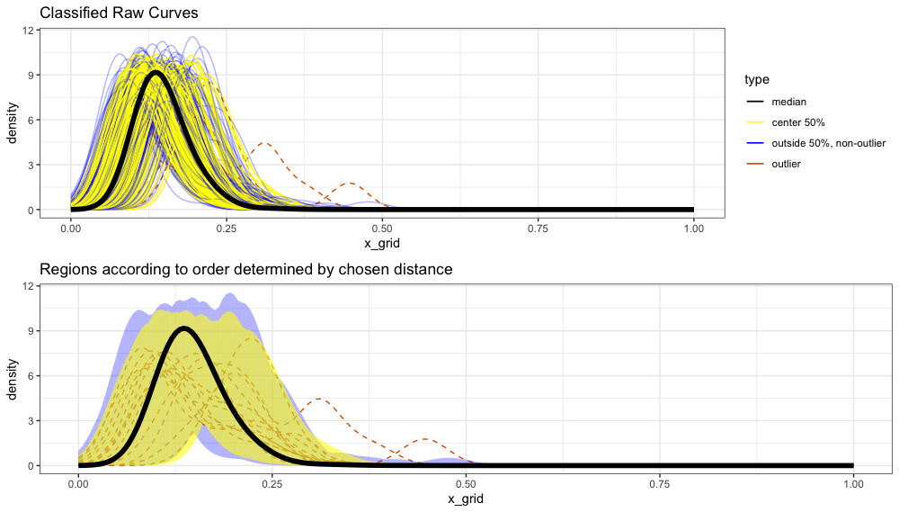

 

The main method `deboinr` of this package orders a data-set consisting of probability density functions on the same grid.  Printing a deboinr object visualizes a boxplot of these functions based on the notion of
distance determined by the user.  It also reports outliers based on the distance chosen and k value, which is the factor by which the IQR is added beyond the center 50 percent of curves.

This repository is organized as a stand-alone R package.  For questions, issues, or clarifications please reach out to Murph: <murph@lanl.gov>.  
## Installation

You can install the latest version from CRAN using:

``` r
install.packages("DeBoinR")
```

``` r
require(DeBoinR)
```

## Examples
PDF data comes from breakthrough curves simulated from the Discrete Fracture Networks computational suite [dfnWorks](https://dfnworks.lanl.gov/).

``` r
xx = deboinr(DeBoinR::x_grid, as.matrix(DeBoinR::pdf_data), distance = "hellinger")
```

``` r
print(xx)
```

<!-- -->

```
Order of Densities:
    
    [1] 280 245 163 148 202 209 106 231 360 164 313 193 187 204 397 362 314  64 281 268 133 206 256 232  76 323  34  91  53 285 398 263 242 258 115 373
    [37] 221  55 186 165 235 142 233 340  63 379 139  13  43  67  14 261 348 351 147 205 223 181 372 241 224 308 144 273 270 330 167 357 108 255 127 234
    [73]  60 269 197 395  85 146 325  56 177 276 390 317 339 199 121 266 159 371 230 396 288 322  22  48 392  24 297 295 155 105 382 217  29 367 111  82
    [109] 138 222 305 363 120 388 350 103 136 211 190 243 220 102 387 244 368 302 238 210 143 212 369 178 118 149 237 309  11  89  16 160 260  44   6 355
    [145]  42  12  74 326 282  84 389 274 201   7 128 200 119  96 365 109 306  10 374 219 364 101 319  32 262  71 259  93 318 249  98 130 216 315 284 132
    [181] 134 294  99 151 337  62 158  28  41 150 169  65  50 277  61  92 324 227  39 182 246  79 125 208 292 198 267 310 265 345 338 278  72 184  36  77
    [217] 196 291  87 331  35  95 298 344   8 116 129 370   4 290 380  90  18  20 321 131  26  15 347  75 251 296 334 110 215 161 229 168 287 279 272  83
    [253] 328 248  66 264 342 114 393  33 113 191 240 300 247  47 358 185  88  70  23 311 112 179 354  52 359 174 377 375 252 346 213   5 253 304 293   2
    [289]  40 381 175 203 156  31  58  25 189 123 329  17 152 135 385 107 275 341 195 188 194 361  38 312  69  46 104  30 154 218 126 332 366   1 226 172
    [325]  19 386  81 286 250 301  57 383 122 327  27 378  97 176 207 394 289  51 333 299 349  78 100  86  59 399  21 162 173 157 225  80 141 320 376 171
    [361] 316 257 303 228  45 356  68  54  73 153 170 192 117 124   3 335 391 336  94  37 254 384 137  49 343 283 140 214 353   9 180 236 145 307 183 271
    [397] 352 239 166
    
Indices of Outliers:
    
    [1]   3   9  37  49  54  73  94 117 124 137 140 145 153 166 170 180 183 192 214 236 239 254 271 283 307 335 336 343 352 353 384 391
```

## Packages Required
parallel, KernSmooth, ggplot2, gridExtra, fda, pracma, stats, dplyr, graphics

## Citation
Alexander C. Murph, Justin D. Strait, Kelly R. Moran, Jeffrey D. Hyman, Hari S. Viswanathan, & Philip H. Stauffer. (2023). Visualization and Outlier Detection for Probability Density Function Ensembles.  _In Review._

## Release

This software has been approved for open source release and has been assigned **O4688** 

## Copyright

© 2023. Triad National Security, LLC. All rights reserved.
This program was produced under U.S. Government contract 89233218CNA000001 for Los Alamos National Laboratory (LANL), which is operated by Triad National Security, LLC for the U.S. Department of Energy/National Nuclear Security Administration. All rights in the program are reserved by Triad National Security, LLC, and the U.S. Department of Energy/National Nuclear Security Administration. The Government is granted for itself and others acting on its behalf a nonexclusive, paid-up, irrevocable worldwide license in this material to reproduce, prepare derivative works, distribute copies to the public, perform publicly and display publicly, and to permit others to do so.

## License

DeBoinR is distributed under a MIT License:

Copyright 2023
Permission is hereby granted, free of charge, to any person obtaining a copy of this software and associated documentation files (the "Software"), to deal in the Software without restriction, including without limitation the rights to use, copy, modify, merge, publish, distribute, sublicense, and/or sell copies of the Software, and to permit persons to whom the Software is furnished to do so, subject to the following conditions:

The above copyright notice and this permission notice shall be included in all copies or substantial portions of the Software.

 THE SOFTWARE IS PROVIDED "AS IS", WITHOUT WARRANTY OF ANY KIND, EXPRESS OR IMPLIED, INCLUDING BUT NOT LIMITED TO THE WARRANTIES OF MERCHANTABILITY, FITNESS FOR A PARTICULAR PURPOSE AND NONINFRINGEMENT. IN NO EVENT SHALL THE AUTHORS OR COPYRIGHT HOLDERS BE LIABLE FOR ANY CLAIM, DAMAGES OR OTHER LIABILITY, WHETHER IN AN ACTION OF CONTRACT, TORT OR OTHERWISE, ARISING FROM, OUT OF OR IN CONNECTION WITH THE SOFTWARE OR THE USE OR OTHER DEALINGS IN THE SOFTWARE.

